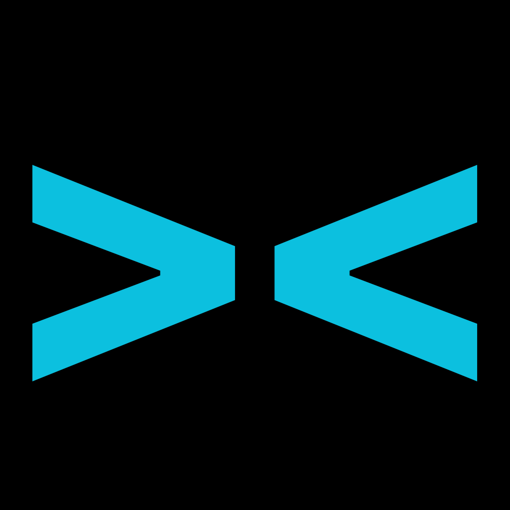

<div align="center">

# Proximity



**Self-hosted Application Delivery Platform for Proxmox VE**

Proximity is a cloud-native application delivery platform that abstracts the complexity of Proxmox VE, providing a simple, web-based interface for deploying and managing containerized applications.

### Your Personal Cloud's Operating System, Built on Proxmox

**The modern, self-hosted application delivery platform that makes deploying containerized apps as easy as browsing a catalog.**

[](tests/)
[](e2e_tests/)
[](https://github.com/fabriziosalmi/proximity)
[](#-architecture)
[](https://github.com/fabriziosalmi/proximity/tree/main/tests)
[](#-dual-mode-operation-new)
[](#-security)
[](LICENSE)
[](https://github.com/fabriziosalmi/proximity)

[Features](#-features) • [Quick Start](#-quick-start) • [Documentation](#-documentation) • [Contributing](#-contributing)

</div>

---

## 🌟 Features

### Core Platform

- **One-Click App Deployment**: Deploy applications from a curated catalog with a single click
- **Fully Automated Setup**: Docker installation and container configuration—all automatic
- **Standard Proxmox Networking**: Uses vmbr0 with DHCP + Docker host networking for direct access
- **Web-Based Management**: Modern, responsive UI with real-time status monitoring
- **REST API**: Full API access for automation and integration
- **Secure by Default**: Unprivileged containers, network isolation, JWT authentication
- **Self-Hosted**: Complete control over your data and applications

## 🎯 What is Proximity?

**Proximity** transforms your Proxmox VE infrastructure into a **powerful application delivery platform**. It abstracts away the complexity of container management, networking, and deployments—giving you a **beautiful, intuitive interface** that feels like using Heroku or Cloudron, but with **complete control** over your own hardware.


### The Problem We Solve

Managing applications on Proxmox typically requires:

- 🔧 Manual LXC container creation and configuration
- 📦 Docker installation and compose file management
- 🌐 Complex networking and reverse proxy setup
- 🔒 Security hardening and access control
- 📊 Monitoring, logging, and backup management
- ⏰ Update tracking and maintenance scheduling

**Proximity handles all of this for you.**

### How It Works

```
Browse App Store → Click Deploy → Watch Progress → Use Your App
```

That's it. One click from browsing to running. Proximity manages the entire lifecycle:

1. **Provisions** an isolated, hardened LXC container on your Proxmox cluster
2. **Installs** Docker and all required dependencies automatically
3. **Configures** networking with automatic port allocation and access URLs
4. **Deploys** your application with proper resource limits and security
5. **Monitors** health, performance, and resource usage in real-time
6. **Maintains** automated backups, updates, and lifecycle management

---

### 🤖 Dual-Mode Operation (NEW!)

**Proximity now offers two distinct operating modes to match your workflow:**

#### AUTO Mode 🤖

Perfect for hands-free operation and peace of mind:

- ✅ **Daily Automated Backups** - All running apps backed up automatically at 2:00 AM
- ✅ **Weekly Update Checks** - System checks for application updates every Sunday
- ✅ **Simplified Interface** - Clean UI focused on essential features
- ✅ **Hands-Free Operation** - Set it and forget it

#### PRO Mode 🛠️

Full professional control for power users:

- ✅ **Manual Backup Control** - Create backups on-demand whenever needed
- ✅ **Clone Applications** - Duplicate running apps with one click
- ✅ **Edit Resources** - Adjust CPU, RAM, and disk allocations on the fly
- ✅ **Advanced Features** - Access all professional-grade tools
- ✅ **Complete Control** - You decide when and how things happen

**Switch modes anytime** from Settings → System → Proximity Mode

---

## 🏗️ Architecture

### Simplified Network Architecture

Proximity uses **standard Proxmox networking** for simplicity and reliability:

- **`vmbr0` Bridge**: All containers connect to the default Proxmox bridge
- **DHCP Configuration**: Containers automatically receive IP addresses from your network's DHCP server
- **Direct Network Access**: No NAT overhead, containers are directly accessible on your network
- **Standard Proxmox Patterns**: Uses conventional Proxmox networking for easy troubleshooting

**Benefits of Simple Architecture:**

- ✅ Less complexity = fewer failure points
- ✅ Standard networking tools work directly
- ✅ Direct container access without NAT overhead
- ✅ Better performance with host networking
- ✅ Easier troubleshooting and debugging

**[Read more →](docs/4_ARCHITECTURE.md)** | **[Network Details →](docs/DOCKER_HOST_NETWORKING.md)**

### Core Components

- **FastAPI Backend**: High-performance async API built with Python 3.13+
- **Proxmox Integration**: Direct API integration + SSH for container management
- **App Service**: Application lifecycle management with Docker Compose
- **Authentication**: JWT-based with role-based access control
- **Scheduler Service**: Automated backup and maintenance tasks (AUTO mode)
- **Modular Frontend**: ES6 modules with state management and component architecture

**Network Simplification (October 2025):**  
Proximity uses standard Proxmox networking (vmbr0 + DHCP) for simplicity and reliability. Containers use Docker's host networking mode for direct access without NAT complexity. This architectural choice significantly reduces infrastructure overhead while maintaining full functionality. See [Docker Host Networking Documentation](docs/DOCKER_HOST_NETWORKING.md) for details.

---

## ✨ Features

### 🚀 **One-Click Deployment**

Deploy applications from a curated catalog in seconds. No Docker knowledge required. Proximity handles container provisioning, Docker installation, networking, and configuration automatically.

### 🎨 **Beautiful "In-App Canvas" Experience**

Access your deployed applications directly within Proximity using our integrated iframe canvas. No need to remember URLs or open new tabs—everything at your fingertips.

### 🖥️ **Integrated Web Console**

Full SSH-like terminal access to every container, right in your browser. No SSH client needed. Built-in security ensures safe remote access.

### 🤖 **AUTO & PRO Modes**

- **AUTO Mode**: Hands-free operation with daily automated backups and weekly update checks
- **PRO Mode**: Full manual control for power users—clone apps, edit resources, advanced configurations

Switch between modes instantly based on your workflow.

### 🎯 **"Living" App Cards**

Real-time monitoring directly on each app card:

- 📊 Live CPU and RAM usage metrics
- 🟢 Status indicators (running, stopped, deploying)
- ⚡ Quick actions (start, stop, restart, backup, update, delete)
- 📦 Volume management and console access
- 🔄 One-click app cloning (PRO mode)

### 🔐 **Security by Default**

- Unprivileged LXC containers for isolation
- JWT-based authentication with role-based access
- Encrypted credential storage
- Network segmentation and firewall rules
- Audit logging for all administrative actions

### 🔧 **Advanced Network Architecture** *(Optional)*

Platinum Edition includes:

- Dedicated network appliance LXC with NAT/routing
- DHCP server for automatic IP assignment
- DNS server with `.prox.local` domain resolution
- Caddy reverse proxy for unified app access
- Isolated app network (`10.20.0.0/24`)

### 💾 **Fearless Backups & Updates**

- Automatic scheduled backups (AUTO mode)
- On-demand backup creation (PRO mode)
- One-click restore from any backup
- Update detection and upgrade workflows
- Zero-downtime snapshot-based backups

### 📡 **Comprehensive Monitoring**

- Real-time infrastructure health dashboard
- Per-app resource usage tracking
- Network activity monitoring
- Container lifecycle event logging
- Proxmox node statistics

### 🔄 **Full Lifecycle Management**

Complete control over your applications:

- **Deploy** from catalog with custom configuration
- **Start/Stop/Restart** with instant feedback
- **Update** to latest versions seamlessly
- **Backup/Restore** with compression options
- **Clone** running applications (PRO mode)
- **Scale** resources on-the-fly (PRO mode)
- **Delete** with automatic cleanup

---

## 📸 Screenshots

> **Visual Demo Coming Soon**  
> We're preparing high-quality GIFs and screenshots showcasing:
> - App Store browsing and deployment flow
> - The "In-App Canvas" experience
> - Real-time monitoring and "Living" app cards
> - The integrated web console
> - Backup and update workflows

---

## 🚀 Quick Start

### Prerequisites

- **Proxmox VE** 7.0 or higher
- **Python** 3.9+
- **SSH access** to your Proxmox host
- **Root privileges** on Proxmox

### Installation (Development Mode)

```bash
# 1. Clone the repository
git clone https://github.com/fabriziosalmi/proximity.git
cd proximity/backend

# 2. Install Python dependencies
pip3 install -r requirements.txt

# 3. Configure environment
cp .env.example .env
# Edit .env with your Proxmox credentials

# 4. Start the application
python3 main.py
```

The Proximity UI will be available at **`http://localhost:8765`**

Proximity is built with security as a top priority:

```bash

The Proximity UI will be available at **`http://localhost:8765`**

## 🔧 Configuration

### First Run

1. **Navigate to** `http://localhost:8765` in your browser
2. **Power On** the application (first-time onboarding)
3. **Register** your admin account
4. **Configure** Proxmox connection settings
5. **Start deploying** apps from the catalog!

### Production Deployment

For production installations with systemd, Docker, or reverse proxy configurations, see:

📘 **[Complete Deployment Guide →](docs/2_DEPLOYMENT.md)**

Edit `.env` with your settings:

```ini
# Proxmox Connection
PROXMOX_HOST=192.168.1.100
PROXMOX_USER=root@pam
PROXMOX_PASSWORD=your_password
PROXMOX_VERIFY_SSL=false

# SSH Settings (for container management)
PROXMOX_SSH_HOST=192.168.1.100
PROXMOX_SSH_PORT=22
PROXMOX_SSH_USER=root
PROXMOX_SSH_PASSWORD=your_password

# API Settings
API_HOST=0.0.0.0
API_PORT=8765
DEBUG=true

# Security
JWT_SECRET_KEY=generate-a-secure-random-key
ENCRYPTION_KEY=generate-another-secure-key
```

---

## 📖 Documentation

### User Documentation

- 📖 **[Introduction & Philosophy](docs/1_INTRODUCTION.md)** - Learn about Proximity's vision and design principles
- 🚀 **[Deployment Guide](docs/2_DEPLOYMENT.md)** - Complete installation and configuration instructions
- 🎯 **[Usage Guide](docs/3_USAGE_GUIDE.md)** - Step-by-step guide to using every feature

### Developer Documentation

- 🏗️ **[Architecture Deep-Dive](docs/4_ARCHITECTURE.md)** - Technical overview of backend, frontend, and networking
- 🛠️ **[Development Guide](docs/5_DEVELOPMENT.md)** - Setup, testing, conventions, and contribution workflow

### Security & Testing

- **[Deployment Guide](docs/2_DEPLOYMENT.md)** - Security configuration and best practices
- **[E2E Testing Guide](e2e_tests/README.md)** - End-to-end testing with Playwright and Pytest

### Feature Documentation

- **[Dual-Mode Operation](#-dual-mode-operation-new)** - AUTO vs PRO mode comparison (see Features section above)
- **[Frontend Architecture](#-modular-frontend-architecture-new)** - ES6 modules and component structure (see below)
- **[Changelog](docs/CHANGELOG.md)** - Version history and release notes

---

## 📱 Application Catalog

Proximity includes pre-configured applications:

### Web Servers & Proxies

- **Nginx** - High-performance web server
- **Caddy** - Modern web server with automatic HTTPS
- **Traefik** - Cloud-native reverse proxy

### Content Management

- **WordPress** - Popular CMS and blogging platform
- **Ghost** - Modern publishing platform

### Development

- **VS Code Server** - Web-based VS Code editor
- **Gitea** - Self-hosted Git service

### And more...

**[Add custom apps →](docs/5_DEVELOPMENT.md#adding-a-new-catalog-item)**

---

## 🏗️ Architecture Overview

Proximity uses a modern, service-oriented architecture:

```
┌─────────────────────────────────────────────────────────┐
│                   Proximity Frontend                     │
│              (Vanilla JS + Modular Architecture)         │
│  Router • Views • Components • State Management          │
└────────────────────┬────────────────────────────────────┘
                     │ REST API (JSON)
┌────────────────────┴────────────────────────────────────┐
│                   Proximity Backend                      │
│                  (FastAPI + SQLite)                      │
│                                                          │
│  ┌─────────────────────────────────────────────────────┐│
│  │  Services Layer                                      ││
│  │  • ProxmoxService    • AppService                   ││
│  │  • NetworkService    • BackupService                ││
│  │  • PortManager       • SchedulerService             ││
│  │  • MonitoringService • TemplateService              ││
│  └─────────────────────────────────────────────────────┘│
└────────────────────┬────────────────────────────────────┘
                     │ Proxmox API
┌────────────────────┴────────────────────────────────────┐
│                  Proxmox VE Cluster                      │
│                                                          │
│  ┌──────────────┐    ┌──────────────┐                  │
│  │   Node 1     │    │   Node 2     │                  │
│  │              │    │              │                  │
│  │  ┌─────────┐ │    │  ┌─────────┐ │                  │
│  │  │ App LXC │ │    │  │ App LXC │ │                  │
│  │  │ (Docker)│ │    │  │ (Docker)│ │                  │
│  │  └─────────┘ │    │  └─────────┘ │                  │
│  └──────────────┘    └──────────────┘                  │
└─────────────────────────────────────────────────────────┘
```

**Key Technologies:**

- **Backend**: FastAPI (Python), SQLite, SQLAlchemy
- **Frontend**: Vanilla JavaScript (ES6 Modules), Custom Router, Observer Pattern
- **Infrastructure**: Proxmox VE, LXC Containers, Docker
- **Networking**: vmbr0 (DHCP) or Custom Bridge with Network Appliance
- **Testing**: pytest (backend), Playwright (E2E), 250+ test suite

For complete architectural details, see **[docs/4_ARCHITECTURE.md](docs/4_ARCHITECTURE.md)**

---

## 🌐 API Documentation

Access interactive API docs at:

- **Swagger UI**: http://localhost:8765/docs
- **ReDoc**: http://localhost:8765/redoc

### Key Endpoints

**Applications:**

- `GET /api/v1/apps` - List deployed applications
- `POST /api/v1/apps/deploy` - Deploy new application
- `POST /api/v1/apps/{app_id}/actions` - Start/stop/restart
- `GET /api/v1/apps/{app_id}/logs` - View application logs
- `DELETE /api/v1/apps/{app_id}` - Delete application

**System:**

- `GET /api/v1/system/info` - System information
- `GET /api/v1/system/nodes` - Proxmox nodes and host status
- `GET /api/v1/system/infrastructure/status` - Infrastructure health check
- `GET /api/v1/system/proxy/status` - Reverse proxy status

**Authentication:**

- `POST /api/v1/auth/register` - Register new user
- `POST /api/v1/auth/login` - Login and get JWT token
- `POST /api/v1/auth/logout` - Logout (audit logging)
- `GET /api/v1/auth/me` - Get current user info

---

## 🛡️ Security

- **Direct Network Access**: Standard vmbr0 networking with firewall enabled
- **Unprivileged Containers**: LXC containers run unprivileged for security
- **JWT Authentication**: Secure API access with token-based auth
- **Role-Based Access**: Admin and user roles with different permissions
- **Network Security**: Firewall rules and secure container isolation
- **Audit Logging**: All user actions logged for compliance
- **SSH Security**: Secure container management via SSH with key authentication

## 🔒 Security

Proximity is built with security as a top priority:

- ✅ **JWT Authentication**: Secure token-based authentication with role-based access control
- ✅ **Safe Command System**: Predefined, read-only commands prevent arbitrary code execution
- ✅ **Audit Logging**: All command executions and critical actions are logged
- ✅ **Standard Networking**: Containers on vmbr0 with firewall enabled by default
- ✅ **Unprivileged Containers**: All LXC containers run unprivileged by default
- ✅ **Input Validation**: Comprehensive parameter validation using Pydantic
- ✅ **No Command Injection**: All commands are hardcoded; user input never interpolated into shell commands

**October 2025 Security Update:**  
We've completely eliminated the dangerous arbitrary command execution endpoint (`/exec`) and replaced it with a secure, predefined command system.

**Available Safe Commands:**

- 📋 logs, ✅ status, 💾 disk, ⚙️ processes, 🧠 memory, 🌐 network, 🐳 images, 📦 volumes, ⚙️ config, 💻 system

All commands are read-only and audited for security compliance.

---

## 🧪 Testing

Proximity includes comprehensive test coverage:

### Backend Unit Tests (pytest)

```bash
cd backend
pytest tests/ -v
```

### End-to-End Tests (Playwright + pytest)

```bash
cd e2e_tests
pytest -v --headed  # Run with visible browser
```

**Test Coverage:**

- ✅ 250+ backend unit tests
- ✅ 30+ E2E integration tests
- ✅ Authentication flows
- ✅ Complete app lifecycle (deploy → manage → delete)
- ✅ Backup/restore workflows
- ✅ Settings and configuration
- ✅ UI navigation and interactions

---

## 📊 Monitoring

**Dashboard Features:**

- Total and running application count
- Infrastructure nodes status
- Resource utilization metrics
- Reverse proxy status
- Real-time deployment tracking

**Application Management:**

- Start/stop/restart applications
- View logs in real-time
- Monitor resource usage
- Access via reverse proxy URLs

---

## 🔄 Development

### Development Setup

```bash
# Clone and setup
git clone https://github.com/fabriziosalmi/proximity.git
cd proximity/backend

python3 -m venv venv
source venv/bin/activate
pip install -r requirements.txt

# Configure and run
cp .env.example .env
python main.py
```

### Running Tests

**Unit and Integration Tests (250+ tests):**

```bash
cd tests/
python3 -m venv venv
source venv/bin/activate
pip install -r requirements.txt
pytest -v
```

**End-to-End Tests (Playwright):**

```bash
cd e2e_tests/
python3 -m venv venv
source venv/bin/activate
pip install -r requirements.txt
playwright install chromium

# Run all E2E tests
pytest -v

# Run specific test suite
pytest test_auth_flow.py -v

# Run with headed browser (watch tests run)
pytest --headed -v

# Run smoke tests only
pytest -m smoke -v
```

See [E2E Testing Guide](e2e_tests/README.md) for comprehensive testing documentation.

### Contributing

We welcome contributions! Please see:

- **[Development Guide](docs/5_DEVELOPMENT.md)** for code structure and workflow
- **[Contributing Guide](CONTRIBUTING.md)** for contribution guidelines
- **[Pre-commit Quick Start](PRE_COMMIT_QUICK_START.md)** for automated quality gates

**Testing:**

- **Run All Tests**: Use `./run_all_tests.sh` or `python run_all_tests.py`
- **Backend Unit Tests**: 250+ tests in `tests/` directory - `pytest tests/`
- **E2E Tests**: Playwright-based browser tests in `e2e_tests/` - `pytest e2e_tests/`
- **Pre-commit Hooks**: Automated code quality and test execution before commits

**Quality Assurance:**

Proximity uses **automated pre-commit hooks** to ensure code quality:

```bash
# One-time setup (after cloning)
./setup_precommit.sh

# Hooks now run automatically on every commit!
```

**What's protected:**
- ✅ Code formatting (Black, Ruff)
- ✅ Syntax validation (YAML, JSON)
- ✅ Whitespace cleanup
- ✅ Backend tests (optional - activate when ready)
- ✅ E2E tests (optional - activate when ready)

See [PRE_COMMIT_QUICK_START.md](PRE_COMMIT_QUICK_START.md) for details.

### Project Structure

```
proximity/
├── backend/
│   ├── api/endpoints/       # REST API routes
│   ├── services/            # Business logic
│   │   ├── app_service.py
│   │   ├── backup_service.py
│   │   ├── scheduler_service.py  # NEW: AUTO mode automation
│   │   └── ...
│   ├── models/              # Database models
│   ├── catalog/             # Application catalog
│   ├── core/                # Core utilities
│   ├── main.py              # Application entry point
│   └── frontend/            # NEW: Modular frontend
│       ├── index.html       # Entry point
│       ├── app.js           # Legacy (compatibility)
│       ├── css/
│       │   └── styles.css   # Global styles + dual-mode CSS
│       ├── js/
│       │   ├── main.js      # ES6 module entry point
│       │   ├── state/
│       │   │   └── appState.js      # State management
│       │   ├── services/
│       │   │   └── api.js           # API service layer
│       │   ├── utils/
│       │   │   ├── auth.js          # Authentication
│       │   │   ├── dom.js           # DOM utilities
│       │   │   ├── notifications.js # Toast system
│       │   │   └── ui.js            # UI mode control
│       │   └── components/          # Future: React-like components
│       └── assets/          # Images, icons, etc.
├── docs/                    # Documentation
│   ├── 1_INTRODUCTION.md
│   ├── 2_DEPLOYMENT.md
│   ├── 3_USAGE_GUIDE.md
│   ├── 4_ARCHITECTURE.md
│   └── 5_DEVELOPMENT.md
├── e2e_tests/               # End-to-end tests
│   ├── pages/               # Page Object Model
│   ├── utils/               # Test utilities
│   ├── conftest.py          # Pytest fixtures
│   ├── test_dual_mode_experience.py  # NEW: Dual-mode tests
│   └── test_*.py            # Test suites
├── tests/                   # Unit and integration tests
└── README.md
```

## 🎨 Modular Frontend Architecture (NEW!)

Proximity's frontend has been completely refactored into a modern, maintainable ES6 module system:

### Architecture Highlights

**Before**: 4,200+ lines monolithic `app.js`
**After**: Clean, modular structure with separation of concerns

```
frontend/js/
├── main.js              ← Entry point (bootstraps everything)
├── state/
│   └── appState.js      ← Centralized state management
├── services/
│   └── api.js           ← API abstraction (40+ endpoints)
├── utils/
│   ├── auth.js          ← JWT token management
│   ├── dom.js           ← DOM manipulation helpers
│   ├── notifications.js ← Toast notification system
│   └── ui.js            ← Dual-mode visibility control
└── components/          ← Future: Component modules
```

### Key Features

- ✅ **ES6 Modules**: Clean import/export syntax
- ✅ **State Management**: Centralized state with getters/setters
- ✅ **API Layer**: All backend calls abstracted to `api.js`
- ✅ **Utility Functions**: Reusable helpers for DOM, auth, notifications
- ✅ **Backward Compatible**: Legacy code still works during transition
- ✅ **Dual-Mode Control**: CSS-based visibility system for AUTO/PRO modes

### Usage Example

```javascript
// Import modules
import { getState, setState } from './state/appState.js';
import { getApps, deployApp } from './services/api.js';
import { showNotification } from './utils/notifications.js';
import { switchProximityMode } from './utils/ui.js';

// Use state management
const currentMode = getState('proximityMode');
setState('proximityMode', 'PRO');

// Call APIs
const apps = await getApps();
await deployApp({ catalog_id: 'nginx', hostname: 'my-app' });

// Show notifications
showNotification('App deployed successfully!', 'success');

// Switch modes
switchProximityMode('AUTO');
```

## 📋 Roadmap

### ✅ Completed

#### Core Platform (v1.0)
- [x] Direct Proxmox API integration
- [x] LXC container management
- [x] Automated Docker installation via SSH
- [x] Standard Proxmox networking (vmbr0 + DHCP)
- [x] Docker host networking for direct access
- [x] Modern web interface
- [x] JWT authentication with RBAC
- [x] Application catalog system
- [x] Template caching for fast deployments

#### Security & Testing (Oct 2025)
- [x] **Safe Command System** - Secure, predefined command execution
- [x] **Audit Logging** - Complete command execution tracking
- [x] **Command Injection Prevention** - Eliminated arbitrary command execution
- [x] **Comprehensive Test Suite** - 250+ unit/integration tests + E2E tests with Playwright
- [x] **E2E Testing Framework** - Page Object Model pattern with Pytest and Playwright

#### Phase 2: Dual-Mode & Modularization (Oct 2025)
- [x] **🤖 AUTO/PRO Mode System** - Dual operating modes for different workflows
- [x] **Automated Backups** - Daily scheduled backups in AUTO mode (2:00 AM)
- [x] **Weekly Update Checks** - Automatic update notifications (Sunday 3:00 AM)
- [x] **Clone Applications** - One-click app duplication (PRO mode)
- [x] **Edit Resources** - Dynamic CPU/RAM/Disk configuration (PRO mode)
- [x] **Scheduler Service** - APScheduler integration for automated tasks
- [x] **Modular Frontend** - ES6 modules with state management
- [x] **Component Architecture** - Separation of concerns (state, services, utils)
- [x] **Dual-Mode E2E Tests** - Complete test coverage for AUTO/PRO modes

### 🚧 In Progress
- [ ] Complete E2E test coverage (all edge cases)
- [ ] Advanced dashboard with real-time metrics
- [ ] Application health monitoring
- [ ] Log aggregation and search

### 📋 Planned
- [ ] Multi-node deployment and load balancing
- [ ] Application scaling (horizontal/vertical)
- [ ] Backup retention policies and cleanup
- [ ] Custom application builder UI
- [ ] Team collaboration features
- [ ] Marketplace integration
- [ ] IPv6 support
- [ ] Advanced firewall and network policies


## 🤝 Contributing

We welcome contributions from the community! Whether it's:

- 🐛 **Bug reports** and feature requests
- 📝 **Documentation** improvements
- 🔧 **Code contributions** (features, fixes, optimizations)
- 🎨 **UI/UX** enhancements
- 🧪 **Test coverage** improvements

### How to Contribute

1. **Fork** the repository
2. **Create** a feature branch (`git checkout -b feature/amazing-feature`)
3. **Commit** your changes (`git commit -m 'Add amazing feature'`)
4. **Push** to your branch (`git push origin feature/amazing-feature`)
5. **Open** a Pull Request

Please read our **[Development Guide](docs/5_DEVELOPMENT.md)** and **[CONTRIBUTING.md](CONTRIBUTING.md)** for detailed guidelines.

---

## 📜 License

Proximity is open-source software licensed under the **MIT License**.

See [LICENSE](LICENSE) for full details.

---

## 🙏 Acknowledgments

Proximity stands on the shoulders of giants:

- **[Proxmox VE](https://www.proxmox.com/)** - The foundation of our platform
- **[FastAPI](https://fastapi.tiangolo.com/)** - Modern Python web framework
- **[Alpine Linux](https://alpinelinux.org/)** - Lightweight container base
- **[Docker](https://www.docker.com/)** - Container runtime
- **[Lucide Icons](https://lucide.dev/)** - Beautiful icon set
- **[Playwright](https://playwright.dev/)** - Reliable E2E testing

And to all our contributors who make Proximity better every day! 🚀

---

## 📬 Support & Community

- 📧 **Email**: [support@proximity.dev](mailto:support@proximity.dev)
- 💬 **Discussions**: [GitHub Discussions](https://github.com/fabriziosalmi/proximity/discussions)
- 🐛 **Issues**: [GitHub Issues](https://github.com/fabriziosalmi/proximity/issues)
- 📖 **Wiki**: [GitHub Wiki](https://github.com/fabriziosalmi/proximity/wiki)

---

<div align="center">

**Made with ❤️ by the Proximity Team**

⭐ **Star us on GitHub** if you find Proximity useful!

[🏠 Homepage](https://github.com/fabriziosalmi/proximity) • [📚 Documentation](docs/) • [🐛 Report Bug](https://github.com/fabriziosalmi/proximity/issues) • [💡 Request Feature](https://github.com/fabriziosalmi/proximity/issues)

</div>
